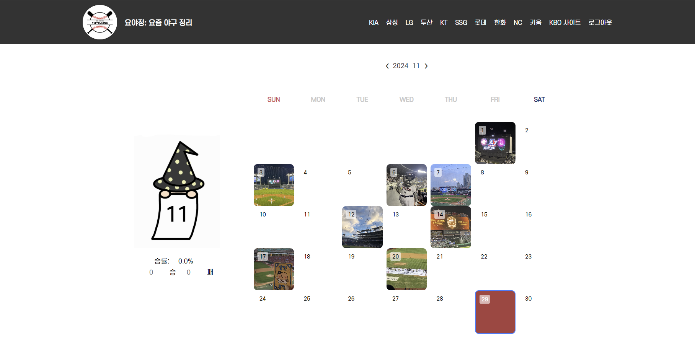
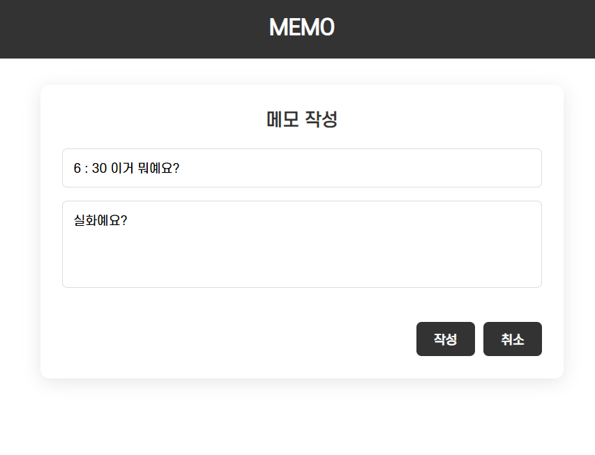
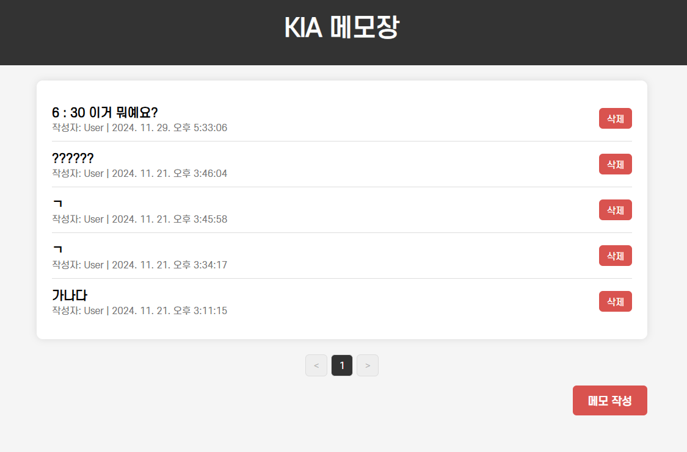
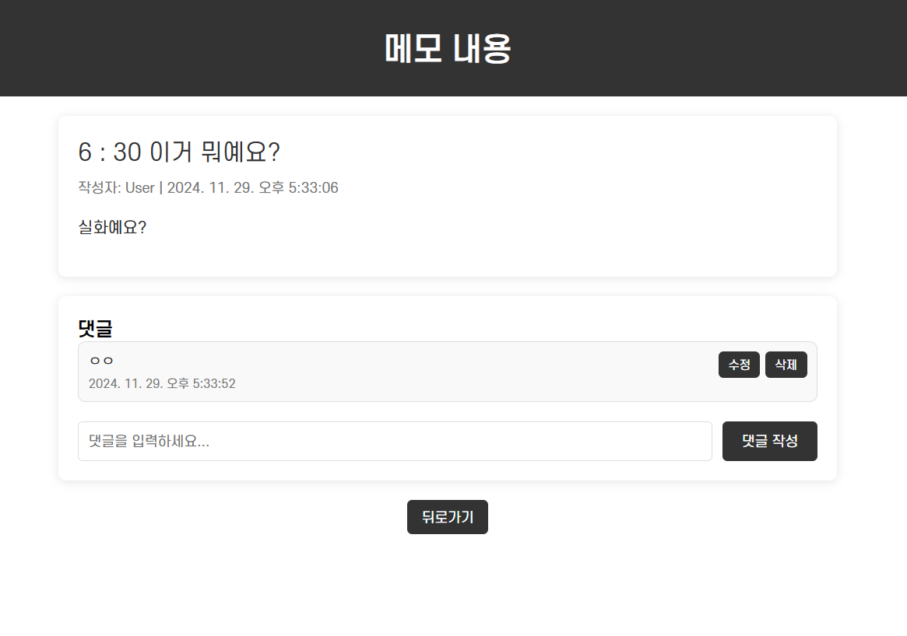

# Progress Report for Team #5

## Progress Summary 
* 계정이 없을 시 로그인 창에서 회원 가입을 선택하여 signup 페이지로 이동합니다. **signup 페이지**에서는 이름, 아이디, 이메일, 비밀번호, 마이팀 설정을 할 수 있으며 아이디가 중복되지 않는다면 회원 가입이 완료됩니다.
* **login 페이지**로 돌아와 아이디와 비밀번호로 로그인을 할 수 있습니다. 로그인 성공 시 메인 페이지인 캘린더로 들어옵니다. 캘린더의 월에 대한 이미지는 회원 가입 시 선택한 **마이팀의 캐릭터**가 반영됩니다. 캘린더의 좌측 중앙에서 총 승리 횟수와 패배 횟수, 그리고 이를 바탕으로 한 **직관 승률**을 퍼센트로 확인할 수 있는데, 현재 이 기능은 구현 중에 있습니다.
* 캘린더의 일자를 선택하면 **해당 날짜의 경기 리스트** 중 하나를 선택할 수 있습니다. 그 중 한 경기를 선택 시 해당 페이지의 일기를 작성할 수 있는 페이지로 이동합니다. 경기 날짜와 경기 시간, 경기 구장 그리고 홈 팀, 어웨이 팀에 대한 정보를 캘린더에서 선택한 대로 반영됩니다. 경기 스코어와 양 팀 선발 라인업을 적고, 나만의 MVP를 선정하고 이미지를 추가하며 코멘트를 적을 수 있는 칸이 구현되어 있습니다. 일기를 다 작성한 후 커뮤니티에 공개할 지 여부를 체크한 후 저장 버튼을 누르면 캘린더에 해당 일기가 저장됩니다.
* 일기를 작성하면 **캘린더 페이지**로 돌아옵니다. 일기 작성 시 추가한 이미지가 해당 날짜 칸에 들어가므로 사용자는 어느 날에 자신이 직관 일기를 작성했는지 확인할 수 있고, 한 달 간 얼마나 직관을 갔는지도 이미지를 통해 확인할 수 있습니다.
* 캘린더 페이지의 상단 메뉴는 **KBO 10개 팀의 커뮤니티**와 **KBO 공식 사이트**, 로그아웃 기능으로 구성되어 있습니다. 한 팀의 커뮤니티를 선택하면, 개인 메모장, 팬들의 공개 일기, 구단 소개, 구장의 먹거리, 우승 정보, 응원가 및 하이라이트, 각 구단별 유튜브 사이트, 구단 공식 사이트, 팀스토어 사이트가 소개되어 있는 **커뮤니티 페이지**로 넘어갑니다. 이 커뮤니티에서 공개로 업로드된 해당 구단 팀의 일기들을 확인할 수 있습니다. 현재 커뮤니티 페이지는 구현 중에 있습니다.
* 각 페이지 간의 DB 연동, 일기 데이터 저장 등은 현재 구현 중에 있습니다.

## Project Schedule

- 2024.11.29 기준 4주차 진행 중에 있습니다.

## Project Screenshot
### 🔏Login

### 🔐SignUp

### 🔍Find id/pw

### 📅Calendar

### 📖Diary

### 👨‍👩‍👧‍👦community

## Individual Progress Status
### 2023202035 오윤서 (조장)
* DB - 프로젝트 간 연결 ([Commit Link](https://github.com/choehyeonjin/OSS-YYJ-group5/commit/ea676c6a5ec3ac1cf41c16997c19d643b2ee86aa#diff-053150b640a7ce75eff69d1a22cae7f0f94ad64ce9a855db544dda0929316519))
* main - signup - login 페이지 연결 ([Commit Link](https://github.com/choehyeonjin/OSS-YYJ-group5/commit/d14a2877cb11c14dd93c1e6b47dd712ac9a6f0de))
* 회원 가입 기능 및 DB 연동 ([Commit Link](https://github.com/choehyeonjin/OSS-YYJ-group5/commit/ea676c6a5ec3ac1cf41c16997c19d643b2ee86aa#diff-55254c2a5ad68fe44f9b1581cf846deeae527b136dbe629031c4ccc17d2ac187))
* 로그인 기능 및 DB 연동 ([Commit Link](https://github.com/choehyeonjin/OSS-YYJ-group5/commit/77af91d7b4dd8a0f2966fdb614c7f2986daa04c4#diff-f61188693df1da3d3179f161f27935924401c469f14d5939ac86cca5f5f47682))

### 2023202034 김송혜
* 로그인 창 디자인 및 구현 ([Commit Link](https://github.com/choehyeonjin/OSS-YYJ-group5/commit/bb0b8d6b2a0d0eef7153e414201cc617b5727171))
* 회원 가입 창 디자인 및 구현 ([Commit Link](https://github.com/choehyeonjin/OSS-YYJ-group5/commit/3a0edad0b6cc1ec1a0e0975e33acf3af476f58b4))
* 아이디 찾기 창 디자인 및 구현 ([Commit Link](https://github.com/choehyeonjin/OSS-YYJ-group5/commit/3a712c69880febe243d51c31867975540fab1242))
* 비밀번호 찾기 창 디자인 및 구현 ([Commit Link](https://github.com/choehyeonjin/OSS-YYJ-group5/commit/7dc27dc8c681ec3885f77f9640223be8b1d2dc4e))
* 로그인 후 넘어가는 메인 캘린더 창 디자인 및 구현 ([Commit Link](https://github.com/choehyeonjin/OSS-YYJ-group5/commit/bb0b8d6b2a0d0eef7153e414201cc617b5727171))
* 직관 일기 작성하는 창 디자인 및 구현 ([Commit Link](https://github.com/choehyeonjin/OSS-YYJ-group5/commit/176b386746e6aedb0677bcfbc2c4bc7d986f989b))
* 구단 별 커뮤니티 페이지 구현 ([Commit Link](https://github.com/choehyeonjin/OSS-YYJ-group5/commit/ba3bceab8da59d2a2e4612e28abc65a3e6b80146))

### 2023202062 장서현

* 구단별 로고 및 캘린더 이미지 제작 ([Commit Link](https://github.com/choehyeonjin/OSS-YYJ-group5/commit/f06a221143728f3ae7b36200b38bda833bd98340)) ([Commit Link](https://github.com/choehyeonjin/OSS-YYJ-group5/commit/21d229d01b98b72f6849381cafd092dc33786844))
* 메인 로고 제작 ([Commit Link](https://github.com/choehyeonjin/OSS-YYJ-group5/commit/bb97dbeb46fcdd21d9230b2b6757d7a1584b8e58))
* 프로젝트 아이디어 ([Commit Link](https://github.com/choehyeonjin/OSS-YYJ-group5/commit/c18a962b1f8188a9931396df66fa1df78d527add))
* 프로젝트 주제 요약 및 docs 관리 ([Commit Link](https://github.com/choehyeonjin/OSS-YYJ-group5/commit/8f7669b90589f60cec41669c2665564d48e56015))
* 회원 가입 디자인 및 성공 메시지 ([Commit Link](https://github.com/choehyeonjin/OSS-YYJ-group5/commit/d251a59fa6d32ab63f334271c4b063e30c85cac7))
* 캘린더 탑 메뉴 구성 구현 ([Commit Link](https://github.com/choehyeonjin/OSS-YYJ-group5/commit/2b76e03bef55807da8442f877c78382ce4163fdc))
* 구단별 캘린더 이미지 변경 구현 ([Commit Link](https://github.com/choehyeonjin/OSS-YYJ-group5/commit/de38196990a4da9d0a512b36a019db41f3c085d9))
* 일기 페이지에서 추가한 이미지 캘린더에 삽입 구현 ([Commit Link](https://github.com/choehyeonjin/OSS-YYJ-group5/commit/2b76e03bef55807da8442f877c78382ce4163fdc))

### 2023202070 최현진

* KBO 웹 스크래핑 (프리시즌, 정규시즌, 포스트시즌 경기 날짜/시간/구장/경기 결과) ([Commit Link](https://github.com/choehyeonjin/OSS-YYJ-group5/commit/3867ca8b8fddffc85fbac7cf2c1cfce4807a323e))
* 캘린더 페이지에서 날짜 클릭 시 경기 선택 ([Commit Link](https://github.com/choehyeonjin/OSS-YYJ-group5/commit/9859533541a8fe8063f9ea9513212a8540b60e21))
* 일기 작성 페이지에 해당 날짜 경기 데이터 출력 ([Commit Link](https://github.com/choehyeonjin/OSS-YYJ-group5/commit/dcb45beb083d6d9deb0c34bcc5485facd2cc7aa8))
* 일기 작성시 경기 결과 선택 (승/패/무) ([Commit Link](https://github.com/choehyeonjin/OSS-YYJ-group5/commit/3bee1941d0b74cf221d198a97831b60d615f9501))
* 아이디 찾기 기능 구현 ([Commit Link](https://github.com/choehyeonjin/OSS-YYJ-group5/commit/a71e98b22d9cf2a996e56d70f10a592665b778c3))
* 비밀번호 찾기 기능 구현 ([Commit Link](https://github.com/choehyeonjin/OSS-YYJ-group5/commit/ac2cff1edd160c0c2f253bf49f4f5cb02bb09b7f))