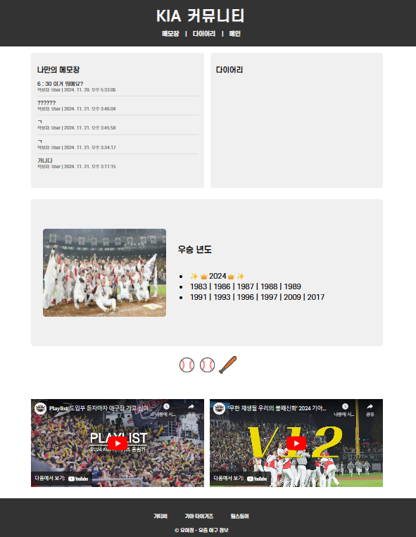

# 요야정⚾_요즘 야구 정리

Web App: [YoYaJung](https://yyjdb-1e121.web.app/)

## 📍Abstract
프로야구의 인기가 날로 높아지고 있습니다. 팬들의 열정적인 관심과 참여는 야구장뿐만 아니라 다양한 온라인 플랫폼에서도 눈에 띄게 증가하고 있습니다.

이러한 추세 속에서, 관람객들 사이에서는 "직관", 즉 경기장에서 직접 경기를 관람한 경험을 기록하고 공유하는 문화가 확산되고 있습니다. 이와 같은 직관 일기는 팬들이 그날의 경기를 어떻게 느꼈는지, 어떤 특별한 순간을 경험했는지 등을 되돌아보는 소중한 기록이 됩니다.

따라서 저희 팀은 이러한 직관 일기를 보다 쉽게 작성하고 공유할 수 있는 플랫폼을 개발하는 것을 목표로 삼았습니다. **직관 일기 공유 플랫폼, 요야정(YYJ, 요즘 야구 정리)** 은 사용자가 각 경기를 관람한 후, 자신의 감상과 경험을 기록하고 다른 팬들과 이를 공유할 수 있는 공간을 제공합니다. 더 나아가, 저희는 팬들이 직관 일기를 작성하면서 자랑할 수 있는 재미있는 기능까지 추가하였습니다. 바로, 데일리 MVP 선정과 직관 승률 계산 기능입니다. 이를 통해 사용자는 자신이 선정한 MVP를 다른 사용자들과 공유하며 해당 경기에 대한 이야기를 나눌 수 있고, 자신이 응원하는 팀의 승리 순간에 얼마나 함께 했는지 확인할 수 있습니다.

요야정은 단순히 경기를 관람하는 차원을 넘어서, 팬들이 스포츠에 더욱 적극적으로 참여하고 자신의 응원 경험을 다른 사람들과 공유할 수 있는 기회를 제공합니다. 또한, 이러한 경험은 팬들에게 단순한 관람을 넘어, 그들만의 특별한 스포츠 문화와 커뮤니티를 형성하는 데 중요한 역할을 할 것입니다.

## ⚾Pages
### 📅사진 캘린더

- 일기를 작성한 날은 해당 날짜에 대한 부분이 **직관 사진**으로 대체됩니다.
- 해당 월에 대한 이미지는 사용자가 선택한 **마이팀**에 따라 달라집니다.
- 캘린더의 좌측하단에는 사용자가 일기 작성 시 선택한 승리 여부를 종합하여 계산된 **직관 승률**이 출력됩니다.
- 사용자가 일기를 작성하기 위해 날짜를 선택하면, 그 날짜의 경기 리스트가 선택창에 뜹니다. 사용자는 이 선택창에서 자신이 관람한 경기를 선택하여 **일기 작성 페이지**로 넘어갈 수 있습니다.

### 📖직관 일기

- 사진 캘린더에서 직관 날짜를 선택하면 해당 날짜에 따른 경기 시간, 날씨, 구장, 팀 정보와 경기 결과가 불러진 일기 작성 페이지로 넘어옵니다.
- 사용자는 이 페이지에서 양팀의 **라인업**을 작성하고, **승리 여부**를 선택하고, **직관 사진**을 추가하고, **일기**를 작성하고, **나만의 MVP**를 선택할 수 있습니다.
- 사용자가 작성한 일기는 사용자의 마이팀 **커뮤니티**에 게시됩니다.

### 👨‍👩‍👧‍👦커뮤니티

- 캘린더의 우측 상단에서 팀명을 누르면 각 팀의 커뮤니티 페이지로 이동합니다.
- 커뮤니티에서는 **나만의 메모장**, **다이어리** 리스트, 그리고 우승년도, 구장 먹거리, 우승 년도 등 그 **팀의 정보**, **구단 유튜브**등을 확인할 수 있습니다.
- 사용자는 커뮤니티에 글을 게시, 수정, 삭제할 수 있으며 댓글 또한 게시, 수정, 삭제 가능합니다.

## 👩‍💻Team roles
**오윤서 (조장)**
- DB - 프로젝트 간 연결
- main - signup - login 페이지 연결
- 회원 가입 기능 및 DB 연동
- 로그인 기능 및 DB 연동
- 직관 기록(경기 정보, 라인업, 일기 내용, 사진 등) DB 연동
- 발표 PPT 제작
  
**김송혜**
- 로그인 창 디자인 및 구현
- 회원 가입 창 디자인 및 구현
- 아이디 찾기 창 디자인 및 구현
- 비밀번호 찾기 창 디자인 및 구현
- 로그인 후 넘어가는 메인 캘린더 창 디자인 및 구현
- 직관 일기 작성하는 창 디자인 및 구현
- 구장 별 커뮤니티 페이지 구현

**장서현**
- 구단별 로고 및 캘린더 이미지 제작
- 메인 로고 제작
- 프로젝트 아이디어 및 docs 관리
- 프로젝트 주제 요약 및 readme, progress 작성
- 회원 가입 디자인 및 성공 메시지
- 구단별 캘린더 이미지 변경 구현
- 일기 페이지에서 추가한 이미지 캘린더에 삽입 구현

**최현진**
- 웹 전체 폰트 선정
- KBO 웹 스크래핑 (경기 날짜/시간/구장/결과)
- 직관 승률 계산 및 캘린더에 출력
- 캘린더 페이지에서 날짜 클릭 시 경기 선택 기능 구현
- 일기 페이지에서 해당 날짜 경기 데이터 출력
- 일기 페이지에 작성한 일기 출력
- id/pw 찾기 기능 구현

## 🗓Schedule
**Due date: 2024/12/17**

**1st meeting(2024/11/06):**
 - Create repository
 - distribute roles

**2nd meeting(2024/11/09):**
 - Report on the progress of each activity
 - Refresh the distribution of added features

**3rd meeting(2024/11/15):**
 - Connect between platform functions
 - perform individual roles

**4th meeting(2024/11/22):**
- Branch orientation during PR
- Implement your role before the next meeting
- Implement each branch and post PR after completing

**5th meeting(2024/11/25):**
- Proceed with database pull request
- Proceed with community page pull request
- Distribute and implement the remaining features to be implemented

**6th meeting(2024/11/29)**
- Combine with all feature develop branches
- To modify the Commit link at PROGRESS.md

**7th meeting(2024/12/02)**
- Implement your own page functionality
- Interworking DBs

**Final meeting(2024/12/17)**
- Check program operation
- Filming and submitting project images

## 💻Technologies

