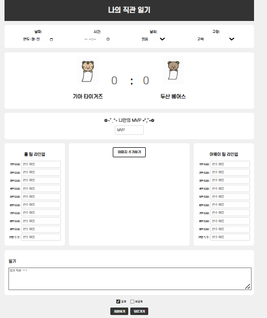

# 요야정⚾_요즘 야구 정리

## 📍Abstract
프로야구의 인기가 날로 높아지고 있습니다. 이러한 팬들의 열정적인 관심과 참여는 야구장뿐만 아니라 다양한 온라인 플랫폼에서도 눈에 띄게 증가하고 있습니다.

이러한 추세 속에서, 관람객들 사이에서는 "직관", 즉 경기장에서 직접 경기를 관람한 경험을 기록하고 공유하는 문화가 확산되고 있습니다. 이와 같은 직관 일기는 팬들이 그날의 경기를 어떻게 느꼈는지, 어떤 특별한 순간을 경험했는지 등을 되돌아보는 소중한 기록이 됩니다.

따라서 저희 팀은 이러한 직관 일기를 보다 쉽게 작성하고 공유할 수 있는 플랫폼을 개발하는 것을 목표로 삼았습니다. **직관 일기 공유 플랫폼, 요아정(YYJ, 요즘 야구 정리)**은 사용자가 각 경기를 관람한 후, 자신의 감상과 경험을 기록하고 다른 팬들과 이를 공유할 수 있는 공간을 제공합니다. 더 나아가, 저희는 팬들이 직관 일기를 작성하면서 자랑할 수 있는 재미있는 기능까지 추가하였습니다. 바로, 데일리 MVP 선정과 직관 승률 계산 기능입니다. 이를 통해 사용자는 자신이 선정한 MVP를 다른 사용자들과 공유하며 해당 경기에 대한 이야기를 나눌 수 있고, 자신이 응원하는 팀의 승리 순간에 얼마나 함께 했는지 확인할 수 있습니다.

요야정은 단순히 경기를 관람하는 차원을 넘어서, 팬들이 스포츠에 더욱 적극적으로 참여하고 자신의 응원 경험을 다른 사람들과 공유할 수 있는 기회를 제공합니다. 또한, 이러한 경험은 팬들에게 단순한 관람을 넘어, 그들만의 특별한 스포츠 문화와 커뮤니티를 형성하는 데 중요한 역할을 할 것입니다.

## ⚾

## 👩‍💻Team roles
**오윤서**
- 어쩌고저쩌고
  
**김송혜**
- 로그인 창 디자인 및 구현
- 회원 가입 창 디자인 및 구현
- 아이디 찾기 창 디자인 및 구현
- 비밀번호 찾기 창 디자인 및 구현
- 로그인 후 넘어가는 메인 캘린더 창 디자인 및 구현
- 직관 일기 작성하는 창 디자인 및 구현
- 구장 별 팬들이 쓴 일기를 볼 수 있는 창 디자인 및 구현

**장서현**
- 구단별 로고 및 캘린더 이미지 제작
- 요야정 로고 제작
- 프로젝트 제목 작성
- 프로젝트 주제 요약 및 readme 작성
- 구단별 캘린더 이미지 변경 구현
- 캘린더에 사진 넣을 수 있는 기능 구현

**최현진**
- 웹 전체 폰트 선정
- KBO 웹 스크래핑 (프리시즌, 정규시즌, 포스트시즌 경기 날짜/시간/결과/구장)
- 경기 결과에 따라 승률 계산
- 캘린더 탭에서 날짜 누르면 일기 작성 탭으로 전환
- 일기 작성 탭에서 해당 날짜 경기 데이터 출력

## 🗓Schedule
**Due date: 2024/12/17**

**1st meeting(2024/11/06):**
 - Create repository
 - distribute roles

**2nd meeting(2024/11/09):**
 - Report on the progress of each activity
 - Refresh the distribution of added features

**3rd meeting(2024/11/15):**
 - Connect between platform functions
 - perform individual roles

**4th meeting(2024/11/22):**
- 어쩌고저쩌고

## 💻Technologies

